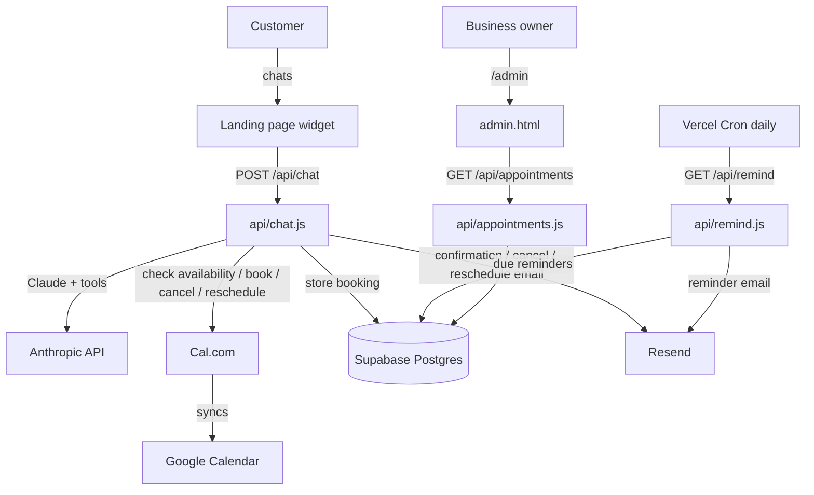

# BizAssist

An AI front-desk assistant for appointment-based businesses (dental clinics, salons,
etc.). It answers customer questions 24/7, books real appointments, and sends
confirmation and reminder emails — reducing no-shows and taking booking load off staff.

Live: [bizzassist.xyz](https://www.bizzassist.xyz)

## What it does

- **Chat widget** on the landing page answers questions and books appointments.
- **Embeddable widget** — a client copies one `<script>` tag from their dashboard's *Connect*
  tab and drops the AI front desk onto their own website (WordPress, Wix, Shopify, Squarespace,
  plain HTML — anywhere). It runs in an isolated Shadow DOM so it can't collide with the host
  page, and only answers once the tenant's subscription is active. No-website clients can share
  the hosted `/c/<slug>` page instead.
- **Real availability** — the bot never invents times. By default a built-in scheduler
  computes each business's open slots from its working hours minus what's already booked
  (free, isolated per tenant); businesses with Cal.com credentials use Cal.com instead.
- **Bookings** are recorded in a Postgres database (Supabase); Cal.com-connected
  businesses also get them on their Google/Outlook calendar.
- **Cancel & reschedule** are handled by the bot itself (no human needed) once the
  customer confirms the phone/email they booked with.
- **Per-staff scheduling** — a multi-person business (e.g. a clinic with several doctors)
  gives each team member optional working days (empty = the business's days). The bot books
  a specific person, checks only that person's days + their own bookings for availability
  (so two staff can hold the same time slot), and never books someone on a day off. Each
  booking records who it's with; the Bookings list and Calendar show it. The Calendar also
  shades days outside the business's working days.
- **Language** — a per-business default language (English by default); the bot still
  auto-matches whatever language the customer writes in.
- **Emails** — branded HTML confirmation on booking, a reminder ~a day before, plus
  cancellation/reschedule notices — sent from the business's own domain via Resend.
- **Admin dashboard** at `/admin` shows every booking in one branded place.
- **Self-serve billing** — a client picks a plan in `/app` and checks out with Paddle;
  Paddle's webhook flips their subscription live automatically, no operator involved.

## Architecture

Static landing page + Vercel serverless functions. No build step, no framework, no
runtime dependencies — every integration is a plain `fetch` call.



## Endpoints

| Path | File | Purpose |
|---|---|---|
| `POST /api/chat` | `api/chat.js` | The AI front desk. Runs a tool loop: `check_availability`, `book_appointment`, `cancel_appointment`, `reschedule_appointment`. |
| `GET /api/remind` | `api/remind.js` | Daily Vercel Cron. Emails reminders for appointments 24–48h out. Gated by `CRON_SECRET`. |
| `GET /api/appointments` | `api/appointments.js` | Powers a dashboard. `?b=<slug>` scopes to one client (auth = master `ADMIN_SECRET` or that client's own secret); no `b` = the default tenant. |
| `GET/POST/PATCH /api/businesses` | `api/businesses.js` | Operator CRUD for client businesses. Gated by master `ADMIN_SECRET`. |
| `GET /api/diag` | `api/diag.js` | Internal health check for the integrations. Gated by `CRON_SECRET`. |
| `GET /api/paddle-config` | `api/paddle-config.js` | Public Paddle.js config (client token + price ids) for the `/app` checkout. |
| `POST /api/paddle-webhook` | `api/paddle-webhook.js` | Paddle subscription events. Verified by HMAC signature; flips `active`/`subscription_status` on the matching business. |
| `POST /api/paddle-portal` | `api/paddle-portal.js` | Owner-authenticated. Returns a Paddle billing-portal URL for the caller's own business. |
| `/admin` | `admin.html` | Bookings dashboard. `/admin?b=<slug>` for a specific client. |
| `/onboard` | `onboard.html` | Operator form to add/edit client businesses (no redeploy). |
| `/c/<slug>` | `chat.html` | A client's hosted chat page (rewrite in `vercel.json`). |
| `/widget.js` | `widget.js` | The embeddable chat widget. A client pastes a one-line `<script>` (generated for them on the `/app` **Connect** tab) onto their own website; it renders scoped to their `slug`. Three display modes via `data-mode`: `bubble` (floating launcher, default), `inline` (panel mounted into a `data-target` element), and `button` (no launcher — opened from the host's own button via `window.BizAssist.open()`). Self-contained, Shadow-DOM-isolated, no dependencies. |
| `POST /api/support` | `api/support.js` | The dashboard's AI **Support** helper — a technical-support assistant for owners (how to install, billing, config). Reuses `ANTHROPIC_API_KEY`, rate-limited, no booking tools or DB access. |

## Code layout

```
api/
  chat.js          AI endpoint + tool loop + system prompt
  remind.js        daily reminder cron
  appointments.js  admin bookings API
  diag.js          integration health check
  lib/
    calcom.js      Cal.com: availability, book, cancel, reschedule
    db.js          Supabase: insert/find/update/cancel/list appointments
    email.js       Resend: sendEmail + branded HTML templates
supabase/
  schema.sql       the appointments table (run once)
api/
  support.js       AI support helper for owners (technical Q&A; separate from the front desk)
admin.html         bookings dashboard
app.html           self-serve client dashboard (config, services & prices, bookings, Connect/install, billing, support)
widget.js          embeddable chat widget (one-line <script> for the client's own site; bubble/inline/button)
index.html         landing page + chat widget
```

The client dashboard (`/app`) tabs: **Business** (name, hours, timezone, availability) and its
**Services & prices** editor (structured price list the AI quotes from), **Staff**, **Connect**
(the install flow above), **Subscription** (Paddle), and **Support** (FAQ + the `/api/support`
AI helper). Everything a business's AI knows is configured here — the AI is assembled per tenant
from this config, so each client's assistant only knows their own business.

## Embedding on a client's own site

Nothing to configure server-side. A logged-in client opens the **Connect** tab in `/app`,
tweaks the look (accent color, greeting, launcher label, position — all encoded into the
snippet, nothing stored), and copies their `<script>` tag:

```html
<script src="https://www.bizzassist.xyz/widget.js"
        data-slug="bright-smile" data-name="Bright Smile Dental"
        data-color="#2E6B4F" defer></script>
```

The widget derives the API origin from its own `src`, so the same file works on any host
domain (`/api/chat` already sends `Access-Control-Allow-Origin: *`). It exposes
`window.BizAssist.open()` / `.close()` / `.toggle()` so a site can also open the chat from
its own button. The AI answers only when the tenant is `active` (the subscription gate); until
then the widget still installs and replies with a friendly "not switched on yet" note.

## Multi-tenant

One deployment serves many clients. A `businesses` row per client holds their config
(name, timezone, hours, address, services, industry, their own Cal.com keys, and their
dashboard password). Requests carry a `slug` that selects the tenant; the chat loads that
business and uses its config for the prompt, Cal.com calls, and emails. **No slug falls
back to env vars** — the original single-client "default" tenant — so nothing breaks.

Onboard a client at `/onboard` (behind the master `ADMIN_SECRET`): fill the form, get back
their chat link (`/c/<slug>`) and dashboard link (`/admin?b=<slug>`). No redeploy. All
tenants email from the one verified domain with their own display name.

## Data model

- **`businesses`** — one row per client tenant (see `supabase/schema.sql`).
- **`appointments`** — `business_id` (null = default tenant), `name`, `phone`, `email`,
  `service`, `start_time`, `calcom_booking_uid`, `reminder_sent`, `status`
  (`confirmed` | `cancelled`), `created_at`.

RLS is on with no policies on purpose — only the server-side service-role key touches
these tables (per-client Cal.com keys live in `businesses`, so it stays locked down).

## Setup & deployment

See [`SETUP.md`](./SETUP.md) for the full account-by-account checklist (Cal.com, Supabase,
Resend) and the environment variables to set in Vercel. Deploys are automatic on push to
`main` via Vercel.

## Local sanity check

There's nothing to install. To syntax-check the functions:

```
npm run check
```
