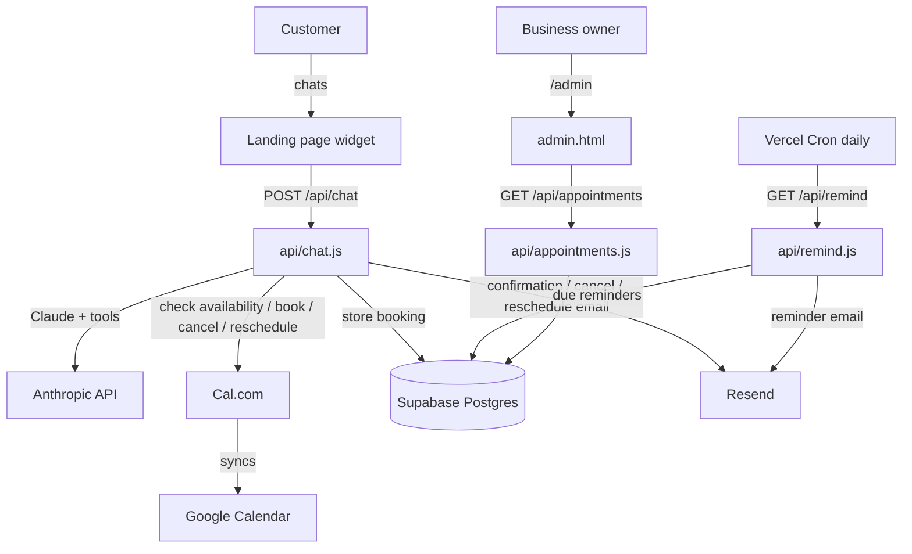

# BizAssist

An AI front-desk assistant for appointment-based businesses (dental clinics, salons,
etc.). It answers customer questions 24/7, books real appointments, and sends
confirmation and reminder emails — reducing no-shows and taking booking load off staff.

Live: [bizzassist.xyz](https://www.bizzassist.xyz)

## What it does

- **Chat widget** on the landing page answers questions and books appointments.
- **Real availability** is pulled from Cal.com — the bot never invents times.
- **Bookings** land on the business's connected Google/Outlook calendar (via Cal.com),
  and are recorded in a Postgres database (Supabase).
- **Cancel & reschedule** are handled by the bot itself (no human needed) once the
  customer confirms the phone/email they booked with.
- **Emails** — branded HTML confirmation on booking, a reminder ~a day before, plus
  cancellation/reschedule notices — sent from the business's own domain via Resend.
- **Admin dashboard** at `/admin` shows every booking in one branded place.
- **Payments** (Paddle) are handled manually, by design — nothing here touches them.

## Architecture

Static landing page + Vercel serverless functions. No build step, no framework, no
runtime dependencies — every integration is a plain `fetch` call.



## Endpoints

| Path | File | Purpose |
|---|---|---|
| `POST /api/chat` | `api/chat.js` | The AI front desk. Runs a tool loop: `check_availability`, `book_appointment`, `cancel_appointment`, `reschedule_appointment`. |
| `GET /api/remind` | `api/remind.js` | Daily Vercel Cron. Emails reminders for appointments 24–48h out. Gated by `CRON_SECRET`. |
| `GET /api/appointments` | `api/appointments.js` | Powers the admin dashboard. Gated by `ADMIN_SECRET`. |
| `GET /api/diag` | `api/diag.js` | Internal health check for the integrations. Gated by `CRON_SECRET`. |
| `/admin` | `admin.html` | Bookings dashboard for the business owner. |

## Code layout

```
api/
  chat.js          AI endpoint + tool loop + system prompt
  remind.js        daily reminder cron
  appointments.js  admin bookings API
  diag.js          integration health check
  lib/
    calcom.js      Cal.com: availability, book, cancel, reschedule
    db.js          Supabase: insert/find/update/cancel/list appointments
    email.js       Resend: sendEmail + branded HTML templates
supabase/
  schema.sql       the appointments table (run once)
admin.html         bookings dashboard
index.html         landing page + chat widget
```

## Data model

One table, `appointments` (see `supabase/schema.sql`): `name`, `phone`, `email`,
`service`, `start_time`, `calcom_booking_uid`, `reminder_sent`, `status`
(`confirmed` | `cancelled`), `created_at`. RLS is on with no policies on purpose — only
the server-side service-role key touches it.

## Setup & deployment

See [`SETUP.md`](./SETUP.md) for the full account-by-account checklist (Cal.com, Supabase,
Resend) and the environment variables to set in Vercel. Deploys are automatic on push to
`main` via Vercel.

## Local sanity check

There's nothing to install. To syntax-check the functions:

```
npm run check
```
